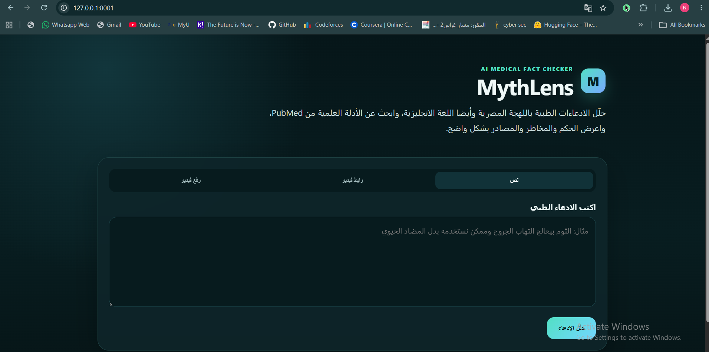
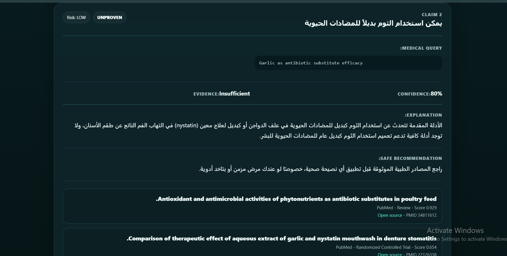
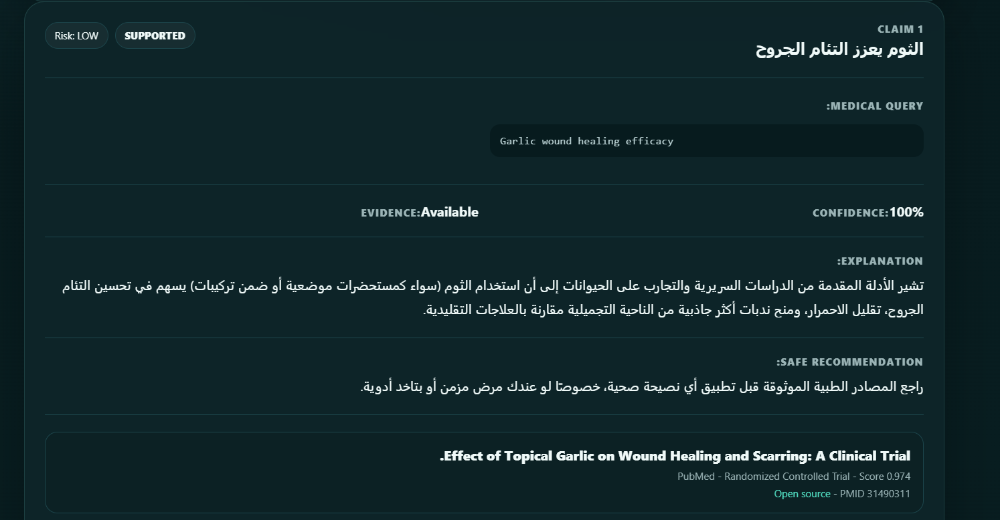
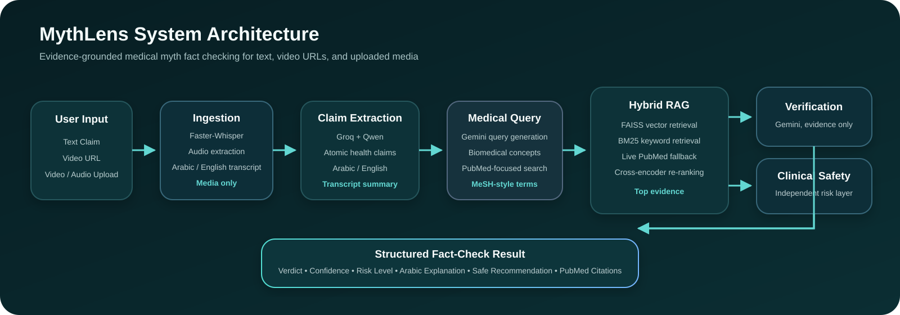
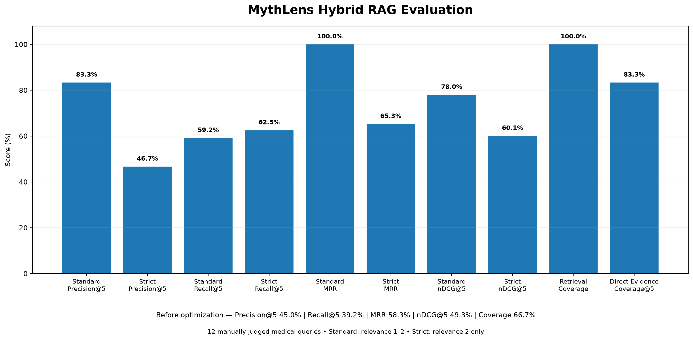

# MythLens

MythLens is an AI-powered medical myth fact-checking system designed for Arabic, Egyptian Arabic, and English health content. It accepts a direct text claim, a video URL, or an uploaded video/audio file, extracts medical claims, retrieves scientific evidence, and returns a structured verdict with safety guidance and citations.

## Product Demo

### Input Interface

<p align="center">
  
</p>

### Fact-Check Results

<table>
  <tr>
    <td width="50%" align="center"><strong>Evidence-limited / Unproven Example</strong></td>
    <td width="50%" align="center"><strong>Supported Example</strong></td>
  </tr>
  <tr>
    <td></td>
    <td></td>
  </tr>
</table>

The interface surfaces claim-level verdicts, confidence, evidence sufficiency, clinical risk, safe recommendations, and linked PubMed evidence with PMID identifiers.

## System Architecture

<p align="center">
  
</p>

The pipeline separates evidence retrieval, verdict generation, and clinical safety so that a claim can be evaluated for scientific support and medical risk independently.

## Key Features

- Text, video URL, and video/audio upload input
- Faster-Whisper transcription for media
- Arabic and Egyptian Arabic processing
- Groq-based health claim extraction and summarization
- PubMed-focused medical query generation
- Hybrid retrieval with local vector search, BM25, and live PubMed fallback
- Evidence re-ranking by relevance and study quality
- Evidence-grounded verification using Gemini
- Verdicts: `SUPPORTED`, `REFUTED`, `MISLEADING`, `UNPROVEN`
- Independent clinical safety assessment: `LOW`, `MODERATE`, `HIGH`, `CRITICAL`
- PubMed citations with PMID and source links
- FastAPI backend with a lightweight web interface
- Retrieval/evaluation utilities for hackathon reporting

## System Flow

```text
Text / Video URL / Video Upload
        ↓
Transcription (media only)
        ↓
Arabic / Egyptian Arabic processing
        ↓
Claim extraction + transcript summary
        ↓
Medical query generation
        ↓
Hybrid RAG: FAISS + BM25 + PubMed
        ↓
Re-ranking
        ↓
Evidence-grounded verification
        ↓
Clinical safety assessment
        ↓
Structured fact-check result + citations
```

## Tech Stack

- Python 3.11+
- FastAPI + Uvicorn
- Faster-Whisper
- Groq (`qwen/qwen3.6-27b` by default)
- Gemini Interactions API
- PubMed / NCBI E-utilities
- FAISS
- Sentence Transformers
- BM25
- Cross-encoder re-ranking
- Vanilla HTML, CSS, and JavaScript

## Repository Structure

```text
MythLens/
├── backend/
│   ├── ingestion/        # video/audio ingestion and transcription
│   ├── arabic/           # Arabic/Egyptian Arabic processing
│   ├── claims/           # health claim extraction and medical queries
│   ├── llm/              # Gemini REST client
│   ├── rag/              # vector search, BM25, PubMed and re-ranking
│   ├── verification/     # verdict generation and clinical safety
│   ├── evaluation/       # evaluation metrics
│   ├── api.py            # FastAPI application
│   └── main.py           # end-to-end integration
├── frontend/             # web interface
├── docs/
│   └── images/           # README screenshots, architecture, evaluation dashboard
├── data/                 # evaluation queries and local dataset documentation
├── scripts/
│   ├── evaluate_rag.py          # baseline RAG/evaluation report utility
│   └── evaluate_hybrid_rag.py   # manually judged Hybrid RAG evaluation
├── .env.example
├── .gitignore
├── requirements.txt
└── README.md
```

## Setup

### 1. Clone the repository

```bash
git clone https://github.com/Nouranwael/MythLens.git
cd MythLens
```

### 2. Create and activate a virtual environment

Windows PowerShell:

```powershell
python -m venv .venv
.\.venv\Scripts\Activate.ps1
```

macOS/Linux:

```bash
python -m venv .venv
source .venv/bin/activate
```

### 3. Install dependencies

```bash
pip install -r requirements.txt
```

### 4. Configure environment variables

Copy `.env.example` to `.env`, then add your keys:

```env
GEMINI_API_KEY=your_gemini_key
GEMINI_MODEL=gemini-3.5-flash-lite

GROQ_API_KEY=your_groq_key
GROQ_MODEL=qwen/qwen3.6-27b

NCBI_API_KEY=
NCBI_EMAIL=
MYTHLENS_LLM_DEBUG=false
```

`GROQ_API_KEY` is required for the current claim-extraction and transcript-summary pipeline. `GEMINI_API_KEY` is required for evidence verification and Gemini-backed query generation where used. NCBI credentials are optional but recommended for higher PubMed request limits.

Never commit `.env` or real API keys.

## Run the Web App

```bash
uvicorn backend.api:app --reload
```

Open:

```text
http://127.0.0.1:8000
```

If port 8000 is already in use:

```bash
uvicorn backend.api:app --reload --port 8001
```

## Main API Endpoints

- `GET /api/health` — service/configuration health check
- `POST /api/analyze/text` — full text fact-check pipeline
- `POST /api/analyze/url` — full video-URL pipeline
- `POST /api/analyze/video` — full uploaded media pipeline
- `POST /api/prepare/text` — claim extraction without verification
- `POST /api/prepare/url` — URL transcription + claim extraction
- `POST /api/prepare/video` — uploaded media transcription + claim extraction
- `POST /api/verify` — verify an already prepared payload

Interactive API documentation is available at `/docs` while the server is running.

## Evaluation Results

MythLens was evaluated on a manually judged 12-query medical retrieval benchmark. Each query retrieved a pool of evidence from the mixed-source Hybrid RAG pipeline, and each candidate was labeled on a graded relevance scale:

- `0` — irrelevant
- `1` — partially/supportively relevant
- `2` — directly relevant

Standard metrics treat relevance grades `1` and `2` as relevant. Strict metrics count only grade `2` as relevant.

| Metric | Standard | Strict |
| --- | ---: | ---: |
| Precision@5 | **83.33%** | **46.67%** |
| Recall@5 | **59.17%** | **62.51%*** |
| MRR | **100.00%** | **65.28%** |
| nDCG@5 | **77.99%** | **60.08%** |
| Retrieval Coverage | **100.00%** | — |
| Direct Evidence Coverage@5 | — | **83.33%** |

\* Strict Recall is averaged over the 11 queries whose judged candidate pool contained at least one directly relevant (`grade 2`) result.

<p align="center">
  
</p>

### Retrieval Improvement

The retrieval pipeline was improved with broader PubMed query fallback, query expansion, deduplication, and revised cross-encoder ranking behavior. On the same 12-query evaluation setup, the standard metrics changed as follows:

| Metric | Before Optimization | After Optimization |
| --- | ---: | ---: |
| Precision@5 | 45.00% | **83.33%** |
| Recall@5 | 39.19% | **59.17%** |
| MRR | 58.33% | **100.00%** |
| nDCG@5 | 49.25% | **77.99%** |
| Retrieval Coverage | 66.67% | **100.00%** |

The reported Recall@5 values are calculated over the manually judged candidate pool, not over the entire PubMed/local corpus. Retrieval evaluation is separate from final verdict correctness, which requires a labeled claim-verdict test set.

### Reproduce the Hybrid RAG Evaluation

Prepare candidate evidence for manual relevance review:

```bash
python scripts/evaluate_hybrid_rag.py --prepare
```

After assigning `relevance` values (`0`, `1`, or `2`) in `outputs/hybrid_eval/review.json`, calculate both standard and strict metrics and regenerate the dashboard:

```bash
python scripts/evaluate_hybrid_rag.py --score outputs/hybrid_eval/review.json
```

The score command generates:

```text
outputs/hybrid_eval/hybrid_rag_metrics.json
outputs/hybrid_eval/hybrid_rag_dashboard.png
docs/images/hybrid_rag_dashboard.png
```

A baseline utility is also available:

```bash
python scripts/evaluate_rag.py --load-models --live-pubmed
```

Generated evaluation outputs, model files, vector indexes, and large datasets are intentionally excluded from Git. Presentation images under `docs/images/` can be committed explicitly when needed.

## Medical Safety

MythLens is a fact-checking and decision-support prototype, not a diagnostic system. Medical outputs are grounded in retrieved evidence where available and include a separate safety-risk assessment. Users should not stop, replace, or change prescribed treatment based only on the application output.

## Security and Repository Hygiene

- `.env`, credentials, local virtual environments, caches, model files, generated vector assets, and large datasets are ignored by Git.
- Only `.env.example` is committed for configuration guidance.
- No API keys are required to be stored in source files.
